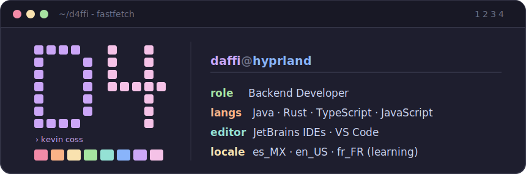

```
╭────────────────────────────────────────────────────────────────╮
│ ‹1› · 2 · 3 · 4         d4ffi@onlyhuman       catppuccin·mocha │
╰────────────────────────────────────────────────────────────────╯
```

```
╭─ ~/d4ffi ────────────────────────────────────────────────────────╮
│                                                                  │
│        ██████╗ ██╗  ██╗███████╗███████╗██╗                       │
│        ██╔══██╗██║  ██║██╔════╝██╔════╝██║                       │
│        ██║  ██║███████║█████╗  █████╗  ██║                       │
│        ██║  ██║╚════██║██╔══╝  ██╔══╝  ██║                       │
│        ██████╔╝     ██║██║     ██║     ██║                       │
│        ╚═════╝      ╚═╝╚═╝     ╚═╝     ╚═╝                       │
│                                                                  │
│        › backend developer · rust + web · local-first tools      │
│                                                                  │
╰──────────────────────────────────────────────────────────────────╯
```

<div align="center">

<a href="https://www.linkedin.com/in/kevin-coss-25427225b/">
  
</a>
<a href="https://daffidev.com">
  
</a>
<a href="mailto:devstuff@bydaffi.com">
  
</a>
<a href="https://github.com/D4ffi">
  
</a>

<br/><br/>


&nbsp;


</div>

---

## ▍ whoami

<div align="center">



</div>

> Programador independiente armando herramientas *local-first*. Me obsesiona
> que las cosas se sientan bien, se vean bien y no dependan de nadie más.

```java
╭─ ~/Daffi.java ───────────────────────────────────────────╮
│                                                          │
│  public class Daffi implements Developer {               │
│                                                          │
│      String   name   = "Kevin Coss";                     │
│      String[] traits = { "creative", "persistent" };     │
│      String[] speaks = { "es_MX", "en_US", "fr_FR" };    │
│                                                          │
│      public Project[] currentFocus() {                   │
│          return new Project[]{ skopos(), footprint() };  │
│      }                                                   │
│  }                                                       │
│                                                          │
╰──────────────────────────────────────────────────────────╯
```

---

## ▍ ~/stack/languages

> La barra de abajo está tejida a mano (`hand-tiled`), pesada por lo que
> estoy construyendo **ahora mismo** — no por stats de toda la vida.

```
╭─ ~/stack/languages ───────────────────────── focus·2026 ─╮
│                                                          │
│  rust          ███████████████████████░░░░░░░  skopos    │
│  typescript    ██████████████████░░░░░░░░░░░░  footprint │
│  javascript    █████████████░░░░░░░░░░░░░░░░░  rudix app │
│  java          ██████████░░░░░░░░░░░░░░░░░░░░  okiro mod │
│  python        ██████░░░░░░░░░░░░░░░░░░░░░░░░  tooling   │
│                                                          │
╰──────────────────────────────────────────────────────────╯
```

<div align="center">


<sub>↑ y esta sí es en vivo desde GitHub · tema Catppuccin Mocha</sub>

</div>

---

## ▍ hyprctl clients · projects

```
╭─ hyprctl workspaces ───────────────────────────────────────╮
│                                                            │
│   [ 1 ]  active                   [ 2 ]  shipped           │
│    › skopos                        › allay dsm             │
│    › footprint                     › okiro tarot cards     │
│    › rudix movilidad                                       │
│    › surfsense local                                       │
╰────────────────────────────────────────────────────────────╯
```

### `[ 1 ]` active &nbsp;·&nbsp; en desarrollo ahora mismo

> **◆ skopos** &nbsp; 
> Observabilidad *local-first* del gasto de tokens y costo de IA. Lee los logs
> de Claude Code, Codex y Gemini directo del disco y los convierte en reportes
> CLI + REPL con costo estimado en USD. Monorepo en Rust.
> `Rust` · `SQLite` · `crossterm` · `CLI/REPL`

> **◆ footprint** &nbsp; 
> Mapa web personal para marcar cada lugar que has visitado — tipos de marker
> personalizados, búsqueda radial de sitios y un modo compartido en pareja
> llamado *lazo*.
> `React` · `TypeScript` · `Vite` · `Firebase` · `Google Maps`

> **◆ RuDix Movilidad** &nbsp; 
> Proyecto de movilidad — app de producto + operación. Construyendo el activo
> y su tooling.
> `App` · `Movilidad` · `Producto`

> **◆ SurfSense local** &nbsp; 
> IA documental self-hosted estilo RAG / NotebookLM. Consultar tus propios
> documentos con modelos locales (Gemma 4, Qwen 3) sobre tu propio hardware.
> `RAG` · `Ollama` · `Gemma 4` · `Qwen 3`

### `[ 2 ]` shipped &nbsp;·&nbsp; ya en producción

> **● Allay DSM** &nbsp; 
> Gestor de servidores dedicados de Minecraft, escrito en Rust.
> `Rust` · `Desktop`

> **● Okiro Tarot Cards** &nbsp; 
> Mod de Fabric que agrega 24 cartas del tarot (arcanos mayores), cada una con
> su propia habilidad especial.
> `Java` · `Fabric` · `Minecraft`

---

## ▍ tech stack

<div align="center">

**languages**


**frontend**


**backend · data**


**tools · environment**


</div>

---

## ▍ git log --stat

<div align="center">


</div>

---

```
╭────────────────────────────────────────────────────────────────╮
│  built with rust · coffee · catppuccin mocha                   │
╰────────────────────────────────────────────────────────────────╯
```

<div align="center">
<sub>⏾ rice de hoy: Catppuccin Mocha · gaps everywhere · gracias por scrollear</sub>
</div>
